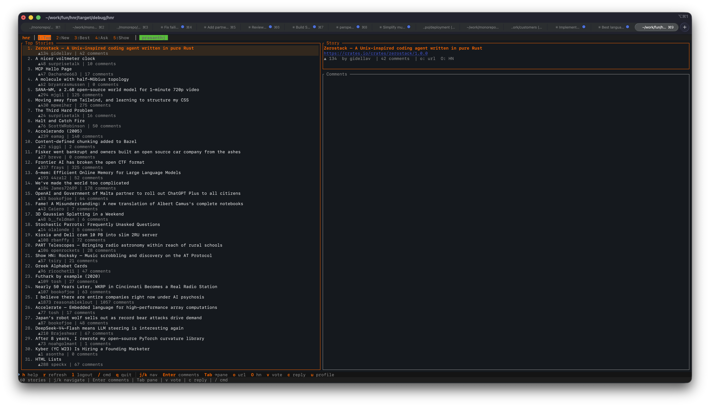

# hnr

### A terminal UI for Hacker News

Browse stories, read threaded comments, search, vote, reply, and bookmark — all without leaving the terminal. Built with Rust and [ratatui](https://ratatui.rs).

## Features

- **Five feeds** — Top, New, Best, Ask HN, Show HN
- **Threaded comments** — recursive tree with collapse/expand and a full-text overlay
- **Search** — Algolia-powered full-text search; press `?` to open, results drop into the story list
- **Bookmarks** — save stories with `b`, browse them on feed `6`, persisted to `~/.hnr/bookmarks.json`
- **Voting & replies** — upvote or reply to any story or comment when logged in
- **User profiles** — view karma, bio, and submission count for any author
- **Open in browser** — jump to the story URL or HN discussion page with `o` / `O`
- **Clipboard** — copy the story URL with `y`
- **Session** — login cookie saved to `~/.hnr/session` and restored on next launch

## Screenshot



## Install

```bash
cargo install hnr
```

## Usage

```bash
hnr
```

## Keybindings

| Key | Action |
|-----|--------|
| `1` – `6` | Switch feed: Top / New / Best / Ask / Show / Bookmarks |
| `j` / `k` / `↑` / `↓` | Navigate up/down |
| `Enter` | Open comments (story pane) · Full-text overlay (comment pane) |
| `Tab` | Switch between story list and comments pane |
| `Esc` | Back to story pane · Close overlay |
| `Space` | Collapse / expand comment thread |
| `b` | Bookmark / unbookmark selected story |
| `?` | Search stories via Algolia |
| `v` | Vote on selected story or comment |
| `c` | Reply to selected story or comment |
| `u` | View author profile |
| `o` | Open story URL in browser |
| `O` | Open HN discussion page in browser |
| `y` | Copy story URL to clipboard |
| `l` | Login / logout |
| `r` | Refresh current feed |
| `h` | Show help |
| `/` | Command mode |
| `q` | Quit |

## Slash Commands

```
/login      /logout     /top        /new        /best
/ask        /show       /bookmarks  /search     /refresh
/user <n>   /bookmark   /open       /hn         /vote
/help       /quit
```

## License

MIT
